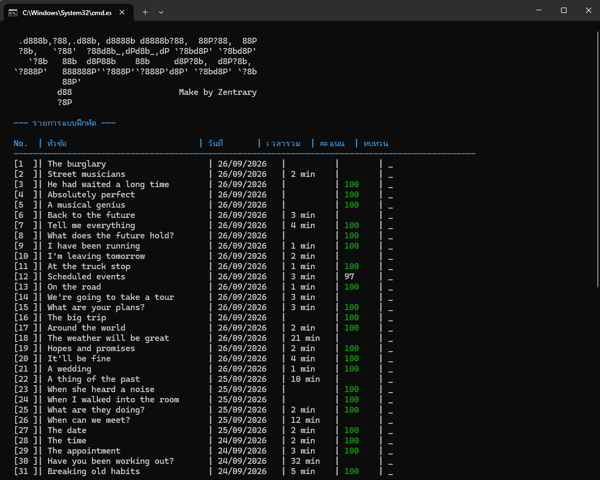

# Speexx Exercise Assistant

เครื่องมือ Python ที่ช่วยทำแบบฝึกหัด Speexx ผ่าน Chrome มีทั้งโหมดเลือกทำเองและโหมดทำต่อเนื่อง พร้อมรายงานผลและไฟล์ช่วยตรวจปัญหา

A Python tool for working through Speexx exercises in Chrome. It includes manual selection and auto-continue modes, plus run reports and diagnostic files.

<p align="center">
  
</p>

## ดูตัวอย่าง / Demo

วิดีโอตัวอย่างบน YouTube: **แทนที่ลิงก์ตัวอย่างด้านล่างด้วย URL คลิปจริงก่อนเผยแพร่**

YouTube demo: **replace the sample URL below with your published video link**

[ดูวิดีโอตัวอย่างบน YouTube / Watch the YouTube demo](https://www.youtube.com/watch?v=YOUR_VIDEO_ID)

## แบบฝึกหัดที่รองรับ / Exercise Types

| แบบฝึกหัด / Exercise | โปรแกรมช่วยทำอะไร / What it does | สถานะ / Status |
| --- | --- | --- |
| กรอกคำตอบ / Fill in the blanks | ใส่คำหรือประโยคลงในช่องว่าง / Fills answer fields with words or sentences | มี Solver / Available |
| ลากวาง / Drag and drop | ลากคำหรือตัวเลือกไปลงช่อง รวมถึงแบบตาราง / Moves tiles into answer slots, including table layouts | มี Solver / Available |
| เลือกคำตอบข้อเดียว / Single choice | เลือกคำตอบที่ถูกในแต่ละข้อ / Selects the correct option for each question | มี Solver / Available |
| เลือกได้หลายคำตอบ / Multiple choice | เลือกตัวเลือกที่ถูกได้หนึ่งข้อหรือหลายข้อ / Selects one or more correct options | มี Solver / Available |
| เรียงประโยค / Scrambled sentence | จัดคำหรือประโยคให้อยู่ในลำดับที่ถูก / Puts words or sentences in the right order | มี Solver / Available |
| เรียงตาราง / Scrambled table | จัดรายการในตารางให้ตรงกับเฉลย / Reorders items in a table | มี Solver / Available |
| เลือกรูปภาพ / Picture choice | เลือกรูปที่ตรงกับโจทย์ / Selects the picture that matches the prompt | มี Solver / Available |
| สลับคำตอบ / Toggle solution | สลับตัวเลือกในช่องจนตรงกับคำตอบ / Cycles through choices until the answer matches | มี Solver / Available |
| ทำเครื่องหมายข้อความ / Mark the text | เลือกคำหรือส่วนข้อความที่โจทย์ถาม / Marks the requested words or text | มี Solver / Available |
| ฝึกออกเสียง / Pronunciation | บันทึกเสียงเทียบกับตัวอย่าง รองรับทั้งข้อเดียวและหลายข้อ / Records speech against the sample, for single or multiple items | มี Solver / Available |
| แบบฝึกหัดวิดีโอ / Video exercise | จัดการเล่นวิดีโอเพื่อให้ไปต่อได้ / Handles video playback so the exercise can continue | มี Solver / Available |

คำว่า “มี Solver / Available” หมายถึงมีตัวช่วยสำหรับชนิดนั้นในโค้ด รูปแบบหน้าเว็บของแต่ละบทเรียนอาจต่างกัน ถ้าหน้าใดทำไม่ได้ โปรแกรมจะบันทึก diagnostic HTML ไว้ตรวจสอบ ไม่ได้รับประกันว่าทุก layout จะทำงานได้เหมือนกัน

“Available” means the code includes a solver for that exercise type. Page layouts can vary between lessons; if a page cannot be handled, the app saves diagnostic HTML for troubleshooting. This does not guarantee that every layout will work identically.

## ทำอะไรได้บ้าง / What It Can Do

- เลือกบทเรียนและแบบฝึกหัดจากหน้า Results / Pick a lesson and exercises from the Results page
- ทำทีละรายการ เลือกหลายรายการ หรือทำแบบฝึกหัดใหม่ต่อเนื่อง / Run one exercise, a selection, or a new-exercise learning path
- บันทึกคะแนน เวลา log และหน้า HTML สำหรับวิเคราะห์ / Save scores, timings, logs, and HTML snapshots for troubleshooting

โหมดทำแบบฝึกหัดใหม่ต่อเนื่องจะเริ่มจากรายการที่เลือก แล้วกด Continue เมื่อทำเสร็จ หากเว็บพากลับหน้า Results โปรแกรมจะมองหารายการถัดไปที่ยังไม่ผ่าน

The new-exercise mode starts from the selected item and presses Continue when it is done. If Speexx returns to Results, the app looks for the next exercise that has not been passed.

## ต้องมีอะไรบ้าง / Requirements

- Windows 10 or later / Windows 10 หรือใหม่กว่า
- Python 3 and `pip` / Python 3 และ `pip`
- Google Chrome installed / ติดตั้ง Google Chrome
- A Speexx account with access to your lessons / บัญชี Speexx ที่เข้าเรียนบทเรียนได้
- Internet access / อินเทอร์เน็ต

## ติดตั้งและเริ่มใช้ / Install and Run

เปิด PowerShell ในโฟลเดอร์โปรเจกต์ แล้วติดตั้งแพ็กเกจ:

Open PowerShell in the project folder and install the required packages:

```powershell
py -m pip install playwright requests colorama
```

รันด้วยคำสั่งนี้ หรือเปิด `run.bat` / Run the app with this command, or open `run.bat`:

```powershell
py main.py
```

โปรแกรมจะเปิด Chrome ให้เลือกบัญชีและเข้าสู่ระบบ ถ้า session เดิมยังใช้ได้ก็เริ่มใช้งานต่อได้เลย

The app opens Chrome so you can choose an account and sign in. If your saved session is still valid, it will continue without asking you to log in again.

## วิธีใช้ / Quick Start

1. เลือกบทเรียนจากหน้า Results / Select a lesson from Results.
2. เลือกรายการ เช่น `1`, `1-5`, `1,3,5` หรือ `all` / Choose items such as `1`, `1-5`, `1,3,5`, or `all`.
3. เลือกทำอัตโนมัติ หรือเลือกโหมดทำแบบฝึกหัดใหม่ต่อเนื่อง / Choose Auto Solve or the new-exercise learning path.
4. เลือกว่าจะทำซ้ำทุกข้อ หรือข้ามข้อที่ผ่านแล้ว / Choose whether to solve passed items again or skip them.

## ไฟล์ที่สร้าง / Generated Files

| Path | ใช้เก็บ / Used for |
| --- | --- |
| `logs/` | บันทึกขั้นตอนและ error / Run logs and errors |
| `reports/` | คะแนนและเวลารูปแบบ JSON / Scores and timings in JSON |
| `webpagedump/` | HTML dump และ diagnostic snapshots / HTML dumps and diagnostic snapshots |
| `chrome_profiles/` | session ของ Chrome / Chrome sessions |
| `config/accounts.json` | บัญชีที่บันทึกไว้ในเครื่อง / Locally saved accounts |

## ความเป็นส่วนตัว / Privacy

- `config/accounts.json` อาจเก็บรหัสผ่านเป็นข้อความธรรมดา และ `chrome_profiles/` มีข้อมูล session อย่า commit หรือส่งสองตำแหน่งนี้ให้คนอื่น
- `config/accounts.json` may contain plain-text passwords, and `chrome_profiles/` contains session data. Do not commit or share them.
- ตรวจ `logs/`, `reports/` และ `webpagedump/` ก่อนแชร์ อาจมีข้อมูลบัญชีหรือเนื้อหาบทเรียน
- Check `logs/`, `reports/`, and `webpagedump/` before sharing; they may contain account details or lesson content.
- ใช้บัญชีของคุณเองและทำตามข้อกำหนดของ Speexx / Use your own account and follow Speexx's terms.
- โปรเจกต์นี้เป็นเครื่องมือไม่เป็นทางการ ไม่มีส่วนเกี่ยวข้องกับ Speexx / This is an unofficial tool and is not affiliated with Speexx.

## เจอปัญหา? / Troubleshooting

ดู log ล่าสุดใน `logs/` และ diagnostic HTML ใน `webpagedump/` จากนั้นลบข้อมูลส่วนตัวก่อนแนบไฟล์เพื่อขอความช่วยเหลือ

Check the latest log in `logs/` and diagnostic HTML in `webpagedump/`. Remove personal data before sharing any files for help.